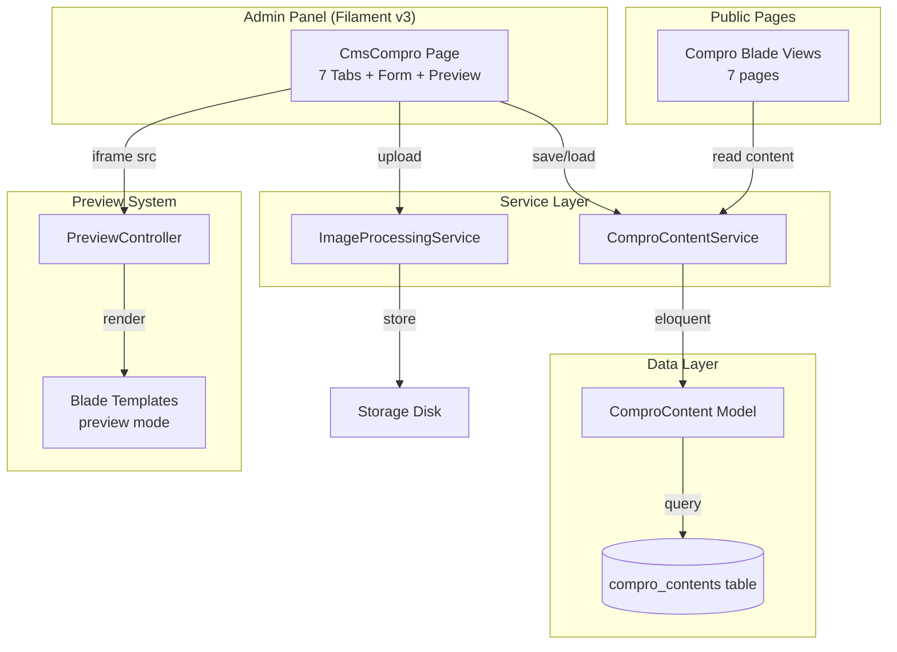
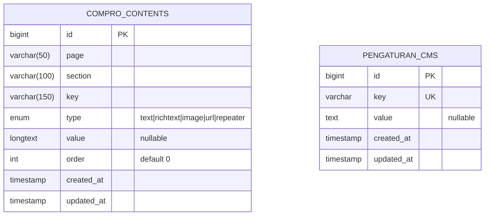

# Design Document: CMS Compro Management

## Overview

Fitur CMS Compro Management menyediakan antarmuka admin berbasis Filament v3 untuk mengelola konten 7 halaman company profile (compro) Patriot Metric. Sistem ini menggunakan tabel database dedicated (`compro_contents`) yang terpisah dari `pengaturan_cms`, mendukung konten statis (teks, gambar, URL) dan konten repeater (daftar dengan ordering), serta menyediakan preview inline via iframe di admin panel.

### Keputusan Desain Utama

1. **Tabel dedicated** — Menggunakan tabel `compro_contents` terpisah dari `pengaturan_cms` untuk menghindari coupling dan memungkinkan schema yang lebih kaya (tipe konten, ordering, page/section grouping).
2. **Single table design** — Semua konten (static + repeater) disimpan dalam satu tabel dengan kolom `type` untuk membedakan. Repeater items disimpan sebagai JSON array di kolom `value`.
3. **Filament Custom Page** — Menggunakan custom Filament Page (bukan Resource) karena UI-nya berupa tabs + form + preview, bukan CRUD table standar.
4. **Service Layer** — `ComproContentService` sebagai single point of access untuk read/write konten, digunakan oleh Filament page dan blade views.
5. **Preview via authenticated route** — Route khusus yang hanya bisa diakses admin (middleware `auth` + panel guard), me-render blade tanpa layout navbar/footer.
6. **7 halaman compro** — Welcome, Profile, Visi-Misi, Tim, Penghargaan, Panduan, Pengumuman.

## Architecture



## Components and Interfaces

### 1. Database Migration

**File:** `database/migrations/xxxx_xx_xx_create_compro_contents_table.php`

```php
Schema::create('compro_contents', function (Blueprint $table) {
    $table->id();
    $table->string('page', 50)->index();        // welcome, profile, visi-misi, tim, penghargaan, panduan, pengumuman
    $table->string('section', 100)->index();     // hero, about, timeline, faq, dll
    $table->string('key', 150);                  // identifier unik dalam section
    $table->enum('type', ['text', 'richtext', 'image', 'url', 'repeater']);
    $table->longText('value')->nullable();       // plain text, HTML, file path, URL, atau JSON array
    $table->unsignedInteger('order')->default(0);
    $table->timestamps();

    $table->unique(['page', 'section', 'key']);  // composite unique constraint
});
```

### 2. Model: ComproContent

**File:** `app/Models/ComproContent.php`

```php
<?php

namespace App\Models;

use Illuminate\Database\Eloquent\Model;
use Illuminate\Database\Eloquent\Casts\Attribute;

class ComproContent extends Model
{
    protected $table = 'compro_contents';

    protected $fillable = [
        'page', 'section', 'key', 'type', 'value', 'order',
    ];

    protected $casts = [
        'order' => 'integer',
    ];

    // Accessor: decode JSON for repeater type
    protected function value(): Attribute
    {
        return Attribute::make(
            get: fn ($value) => $this->type === 'repeater' ? json_decode($value, true) : $value,
            set: fn ($value) => is_array($value) ? json_encode($value) : $value,
        );
    }

    // Scopes
    public function scopeForPage($query, string $page)
    {
        return $query->where('page', $page);
    }

    public function scopeForSection($query, string $section)
    {
        return $query->where('section', $section);
    }

    public function scopeStatic($query)
    {
        return $query->where('type', '!=', 'repeater');
    }

    public function scopeRepeater($query)
    {
        return $query->where('type', 'repeater');
    }
}
```

### 3. DTO: ComproContentDTO

**File:** `app/DTO/ComproContentDTO.php`

```php
<?php

namespace App\DTO;

use App\Models\ComproContent;

readonly class ComproContentDTO
{
    public function __construct(
        public string $page,
        public string $section,
        public string $key,
        public string $type,
        public string|array|null $value,
        public int $order = 0,
    ) {}

    public static function fromModel(ComproContent $model): self
    {
        return new self(
            page: $model->page,
            section: $model->section,
            key: $model->key,
            type: $model->type,
            value: $model->value,
            order: $model->order,
        );
    }

    public static function fromArray(array $data): self
    {
        return new self(
            page: $data['page'],
            section: $data['section'],
            key: $data['key'],
            type: $data['type'],
            value: $data['value'] ?? null,
            order: $data['order'] ?? 0,
        );
    }
}
```

### 4. Service: ComproContentService

**File:** `app/Services/ComproContentService.php`

```php
<?php

namespace App\Services;

use App\Models\ComproContent;
use Illuminate\Support\Collection;
use Illuminate\Support\Facades\Cache;

class ComproContentService
{
    private const CACHE_TTL = 3600; // 1 hour

    /**
     * Get all content for a specific page, grouped by section.
     */
    public function getPageContent(string $page): Collection
    {
        return Cache::remember(
            "compro_content.{$page}",
            self::CACHE_TTL,
            fn () => ComproContent::forPage($page)
                ->orderBy('section')
                ->orderBy('order')
                ->get()
                ->groupBy('section')
        );
    }

    /**
     * Get a single content value by page, section, and key.
     */
    public function getValue(string $page, string $section, string $key): string|array|null
    {
        $content = ComproContent::forPage($page)
            ->forSection($section)
            ->where('key', $key)
            ->first();

        return $content?->value;
    }

    /**
     * Update static content values for a page.
     */
    public function updateStaticContent(string $page, array $data): void
    {
        foreach ($data as $sectionKey => $value) {
            [$section, $key] = explode('.', $sectionKey, 2);

            ComproContent::updateOrCreate(
                ['page' => $page, 'section' => $section, 'key' => $key],
                ['value' => $value]
            );
        }

        $this->clearCache($page);
    }

    /**
     * Update repeater content for a specific section.
     */
    public function updateRepeaterContent(string $page, string $section, string $key, array $items): void
    {
        ComproContent::updateOrCreate(
            ['page' => $page, 'section' => $section, 'key' => $key],
            ['value' => $items, 'type' => 'repeater']
        );

        $this->clearCache($page);
    }

    /**
     * Clear cache for a page.
     */
    public function clearCache(string $page): void
    {
        Cache::forget("compro_content.{$page}");
    }

    /**
     * Get all pages with their sections for admin navigation.
     */
    public function getPageStructure(): array
    {
        return [
            'welcome' => ['hero', 'about', 'institusi', 'timeline', 'instagram'],
            'profile' => ['hero', 'latar-belakang', 'tujuan-utama'],
            'visi-misi' => ['hero', 'visi', 'misi'],
            'tim' => ['hero', 'team-grid'],
            'penghargaan' => ['hero', 'daftar-penerima'],
            'panduan' => ['hero', 'steps', 'faq'],
            'pengumuman' => ['hero', 'artikel'],
        ];
    }
}
```

### 5. Service: ImageProcessingService

**File:** `app/Services/ImageProcessingService.php`

```php
<?php

namespace App\Services;

use Illuminate\Http\UploadedFile;
use Illuminate\Support\Facades\Storage;
use Intervention\Image\Laravel\Facades\Image;

class ImageProcessingService
{
    private const MAX_WIDTH = 1920;
    private const MAX_HEIGHT = 1080;
    private const STORAGE_DISK = 'public';
    private const UPLOAD_PATH = 'compro-images';

    /**
     * Process and store an uploaded image.
     * Converts to WebP, resizes if needed, stores in public disk.
     *
     * @return string The stored file path relative to disk root
     */
    public function processAndStore(UploadedFile $file, ?string $existingPath = null): string
    {
        // Delete existing file if replacing
        if ($existingPath) {
            $this->delete($existingPath);
        }

        // Process image: resize if exceeds max dimensions
        $image = Image::read($file);

        if ($image->width() > self::MAX_WIDTH || $image->height() > self::MAX_HEIGHT) {
            $image->scaleDown(self::MAX_WIDTH, self::MAX_HEIGHT);
        }

        // Encode as WebP
        $encoded = $image->toWebp(quality: 85);

        // Generate unique filename
        $filename = uniqid('compro_') . '.webp';
        $path = self::UPLOAD_PATH . '/' . $filename;

        // Store
        Storage::disk(self::STORAGE_DISK)->put($path, (string) $encoded);

        return $path;
    }

    /**
     * Delete an image from storage.
     */
    public function delete(string $path): void
    {
        if (Storage::disk(self::STORAGE_DISK)->exists($path)) {
            Storage::disk(self::STORAGE_DISK)->delete($path);
        }
    }
}
```

### 6. Filament Custom Page: CmsCompro

**File:** `app/Filament/Pages/CmsCompro.php`

Arsitektur halaman admin menggunakan Filament Custom Page dengan:
- **7 Tabs** untuk setiap halaman compro (Welcome, Profile, Visi-Misi, Tim, Penghargaan, Panduan, Pengumuman)
- **Split layout**: Form di sisi kiri, iframe preview di sisi kanan
- **Toggle preview**: Tombol untuk show/hide panel preview
- **Auto-refresh**: Setelah save, iframe di-reload via Livewire event

```php
<?php

namespace App\Filament\Pages;

use App\Services\ComproContentService;
use App\Services\ImageProcessingService;
use Filament\Forms\Components\{Tabs, Section, TextInput, Textarea, RichEditor, FileUpload, Repeater, Toggle};
use Filament\Forms\Concerns\InteractsWithForms;
use Filament\Forms\Form;
use Filament\Notifications\Notification;
use Filament\Pages\Page;

class CmsCompro extends Page
{
    protected static string $view = 'filament.pages.cms-compro';
    protected static ?string $navigationIcon = 'heroicon-o-globe-alt';
    protected static ?string $navigationLabel = 'CMS Compro';
    protected static ?string $navigationGroup = 'Konten Website';
    protected static ?int $navigationSort = 1;

    public ?array $data = [];
    public string $activeTab = 'welcome';
    public bool $showPreview = true;

    public function mount(): void { /* load content for active tab */ }
    public function updatedActiveTab(): void { /* reload form data for new tab */ }
    public function save(): void { /* persist form data, clear cache, dispatch preview refresh */ }
}
```

### 7. Preview Controller

**File:** `app/Http/Controllers/ComproPreviewController.php`

```php
<?php

namespace App\Http\Controllers;

use App\Services\ComproContentService;
use Illuminate\Http\Request;

class ComproPreviewController extends Controller
{
    public function __construct(
        private ComproContentService $contentService
    ) {}

    /**
     * Render a compro page in preview mode (no navbar/footer).
     * Only accessible by authenticated admin users.
     */
    public function show(Request $request, string $page): \Illuminate\View\View
    {
        $validPages = ['welcome', 'profile', 'visi-misi', 'tim', 'penghargaan', 'panduan', 'pengumuman'];

        abort_unless(in_array($page, $validPages), 404);

        $content = $this->contentService->getPageContent($page);

        return view("compro-preview.{$page}", [
            'content' => $content,
            'previewMode' => true,
        ]);
    }
}
```

**Route (di `routes/web.php`):**

```php
Route::get('/admin/compro-preview/{page}', [ComproPreviewController::class, 'show'])
    ->middleware(['auth', 'verified']) // hanya admin yang bisa akses
    ->name('compro.preview');
```

### 8. Filament Page View (Blade)

**File:** `resources/views/filament/pages/cms-compro.blade.php`

Layout utama halaman CMS Compro di admin panel:

```html
<x-filament-panels::page>
    <div class="flex flex-col lg:flex-row gap-6" x-data="{ showPreview: @entangle('showPreview') }">
        {{-- Form Panel --}}
        <div :class="showPreview ? 'lg:w-1/2' : 'w-full'" class="transition-all">
            {{-- Tab Navigation --}}
            <div class="flex gap-2 mb-4 overflow-x-auto">
                @foreach(['welcome', 'profile', 'visi-misi', 'tim', 'penghargaan', 'panduan', 'pengumuman'] as $page)
                    <button wire:click="$set('activeTab', '{{ $page }}')"
                        class="px-4 py-2 rounded-lg text-sm font-medium whitespace-nowrap
                            {{ $activeTab === $page ? 'bg-primary-500 text-white' : 'bg-gray-100 text-gray-700' }}">
                        {{ ucfirst(str_replace('-', ' ', $page)) }}
                    </button>
                @endforeach
            </div>

            {{-- Form Content --}}
            <form wire:submit="save">
                {{ $this->form }}
                <div class="mt-4">
                    <x-filament::button type="submit">Simpan</x-filament::button>
                </div>
            </form>
        </div>

        {{-- Preview Panel --}}
        <div x-show="showPreview" class="lg:w-1/2" x-transition>
            <div class="sticky top-4">
                <div class="flex items-center justify-between mb-2">
                    <h3 class="text-sm font-medium text-gray-700">Preview</h3>
                    <button @click="showPreview = false" class="text-gray-400 hover:text-gray-600">
                        <x-heroicon-s-x-mark class="w-5 h-5" />
                    </button>
                </div>
                <iframe
                    id="preview-frame"
                    src="{{ route('compro.preview', ['page' => $activeTab]) }}"
                    class="w-full h-[600px] border rounded-lg"
                    wire:key="preview-{{ $activeTab }}"
                ></iframe>
            </div>
        </div>

        {{-- Toggle Preview Button (when hidden) --}}
        <button x-show="!showPreview" @click="showPreview = true"
            class="fixed bottom-4 right-4 bg-primary-500 text-white px-4 py-2 rounded-lg shadow-lg">
            Tampilkan Preview
        </button>
    </div>

    @script
    <script>
        $wire.on('content-saved', () => {
            const iframe = document.getElementById('preview-frame');
            if (iframe) iframe.src = iframe.src; // reload iframe
        });
    </script>
    @endscript
</x-filament-panels::page>
```

### 9. Form Schema per Page

Setiap halaman memiliki form schema yang didefinisikan dalam class terpisah:

#### WelcomeForm

**File:** `app/Filament/Pages/ComproForms/WelcomeForm.php`

```php
<?php

namespace App\Filament\Pages\ComproForms;

use Filament\Forms\Components\{Section, TextInput, Textarea, RichEditor, FileUpload, Repeater};

class WelcomeForm
{
    public static function schema(): array
    {
        return [
            Section::make('Hero')
                ->schema([
                    TextInput::make('hero.judul')->label('Judul Utama')->maxLength(255)->required(),
                    Textarea::make('hero.deskripsi')->label('Deskripsi')->maxLength(500)->required(),
                    FileUpload::make('hero.background_image')
                        ->label('Background Image')
                        ->image()
                        ->acceptedFileTypes(['image/jpeg', 'image/png', 'image/webp'])
                        ->maxSize(2048),
                ]),

            Section::make('About')
                ->schema([
                    TextInput::make('about.judul')->label('Judul')->maxLength(255)->required(),
                    RichEditor::make('about.deskripsi')
                        ->label('Deskripsi (paragraf + bullet points)')
                        ->maxLength(10000)
                        ->required()
                        ->toolbarButtons([
                            'bold', 'italic', 'underline',
                            'bulletList', 'orderedList',
                            'link', 'undo', 'redo',
                        ]),
                    TextInput::make('about.video_url')->label('URL Video YouTube')->url()->maxLength(255),
                ]),

            Section::make('Institusi Partisipan')
                ->schema([
                    TextInput::make('institusi.judul')->label('Judul Section')->maxLength(255)->required(),
                    Textarea::make('institusi.deskripsi')->label('Deskripsi Section')->maxLength(500),
                    Repeater::make('institusi.daftar_baris_1')
                        ->label('Daftar Institusi Baris 1')
                        ->schema([
                            TextInput::make('nama')->label('Nama Institusi')->maxLength(150)->required(),
                            FileUpload::make('logo')
                                ->label('Logo Institusi')
                                ->image()
                                ->acceptedFileTypes(['image/jpeg', 'image/png', 'image/webp'])
                                ->maxSize(2048)
                                ->required(),
                        ])
                        ->maxItems(50)
                        ->reorderable()
                        ->collapsible()
                        ->itemLabel(fn (array $state) => $state['nama'] ?? 'Institusi Baru'),
                    Repeater::make('institusi.daftar_baris_2')
                        ->label('Daftar Institusi Baris 2')
                        ->schema([
                            TextInput::make('nama')->label('Nama Institusi')->maxLength(150)->required(),
                            FileUpload::make('logo')
                                ->label('Logo Institusi')
                                ->image()
                                ->acceptedFileTypes(['image/jpeg', 'image/png', 'image/webp'])
                                ->maxSize(2048)
                                ->required(),
                        ])
                        ->maxItems(50)
                        ->reorderable()
                        ->collapsible()
                        ->itemLabel(fn (array $state) => $state['nama'] ?? 'Institusi Baru'),
                ]),

            Section::make('Timeline')
                ->schema([
                    TextInput::make('timeline.judul')->label('Judul Section')->maxLength(255)->required(),
                    Textarea::make('timeline.deskripsi')->label('Deskripsi Section')->maxLength(500),
                    Repeater::make('timeline.daftar')
                        ->label('Daftar Timeline')
                        ->schema([
                            TextInput::make('nomor')->label('Nomor')->maxLength(10)->required(),
                            TextInput::make('tanggal')->label('Tanggal')->maxLength(50)->required(),
                            TextInput::make('judul')->label('Judul')->maxLength(150)->required(),
                            Textarea::make('deskripsi')->label('Deskripsi')->maxLength(500)->required(),
                        ])
                        ->maxItems(50)
                        ->reorderable()
                        ->collapsible()
                        ->itemLabel(fn (array $state) => ($state['nomor'] ?? '') . ' - ' . ($state['judul'] ?? 'Item Baru')),
                ]),

            Section::make('Instagram')
                ->schema([
                    TextInput::make('instagram.judul')->label('Judul Section')->maxLength(255),
                    Textarea::make('instagram.deskripsi')->label('Deskripsi')->maxLength(500),
                    Repeater::make('instagram.posts')
                        ->label('Post Instagram')
                        ->schema([
                            TextInput::make('url')->label('URL Post')->url()->maxLength(255)->required(),
                            FileUpload::make('gambar')->label('Gambar')->image()->maxSize(2048),
                            TextInput::make('alt_text')->label('Alt Text')->maxLength(255),
                        ])
                        ->maxItems(50)
                        ->reorderable()
                        ->collapsible(),
                ]),
        ];
    }
}
```

#### ProfileForm

**File:** `app/Filament/Pages/ComproForms/ProfileForm.php`

```php
<?php

namespace App\Filament\Pages\ComproForms;

use Filament\Forms\Components\{Section, TextInput, Textarea, RichEditor, FileUpload, Repeater};

class ProfileForm
{
    public static function schema(): array
    {
        return [
            Section::make('Hero')
                ->schema([
                    TextInput::make('hero.judul')->label('Judul')->maxLength(255)->required(),
                    Textarea::make('hero.deskripsi')->label('Deskripsi')->maxLength(500)->required(),
                    FileUpload::make('hero.background_image')
                        ->label('Background Image')
                        ->image()
                        ->acceptedFileTypes(['image/jpeg', 'image/png', 'image/webp'])
                        ->maxSize(2048),
                ]),

            Section::make('Latar Belakang')
                ->schema([
                    TextInput::make('latar-belakang.judul')->label('Judul Section')->maxLength(255)->required(),
                    RichEditor::make('latar-belakang.deskripsi')
                        ->label('Deskripsi (semua paragraf)')
                        ->maxLength(10000)
                        ->required()
                        ->toolbarButtons([
                            'bold', 'italic', 'underline',
                            'bulletList', 'orderedList',
                            'link', 'undo', 'redo',
                        ]),
                ]),

            Section::make('Tujuan Utama')
                ->schema([
                    TextInput::make('tujuan-utama.judul')->label('Judul Section')->maxLength(255)->required(),
                    Textarea::make('tujuan-utama.deskripsi')->label('Deskripsi Section')->maxLength(500),
                    Repeater::make('tujuan-utama.daftar')
                        ->label('Daftar Tujuan')
                        ->schema([
                            TextInput::make('nomor')->label('Nomor')->maxLength(10)->required(),
                            TextInput::make('judul')->label('Judul')->maxLength(150)->required(),
                            Textarea::make('deskripsi')->label('Deskripsi')->maxLength(500)->required(),
                        ])
                        ->maxItems(50)
                        ->reorderable()
                        ->collapsible()
                        ->itemLabel(fn (array $state) => ($state['nomor'] ?? '') . ' - ' . ($state['judul'] ?? 'Item Baru')),
                ]),
        ];
    }
}
```

#### VisiMisiForm

**File:** `app/Filament/Pages/ComproForms/VisiMisiForm.php`

```php
<?php

namespace App\Filament\Pages\ComproForms;

use Filament\Forms\Components\{Section, TextInput, Textarea, Repeater};

class VisiMisiForm
{
    public static function schema(): array
    {
        return [
            Section::make('Hero')
                ->schema([
                    TextInput::make('hero.judul')->label('Judul')->maxLength(255)->required(),
                    Textarea::make('hero.deskripsi')->label('Deskripsi')->maxLength(500)->required(),
                ]),

            Section::make('Visi')
                ->schema([
                    Textarea::make('visi.teks')->label('Teks Visi')->maxLength(1000)->required(),
                ]),

            Section::make('Misi')
                ->schema([
                    TextInput::make('misi.judul')->label('Judul Section')->maxLength(255)->required(),
                    Repeater::make('misi.daftar')
                        ->label('Daftar Misi')
                        ->schema([
                            TextInput::make('nomor')->label('Nomor')->maxLength(10)->required(),
                            TextInput::make('judul')->label('Judul')->maxLength(150)->required(),
                            Textarea::make('deskripsi')->label('Deskripsi')->maxLength(500)->required(),
                        ])
                        ->maxItems(50)
                        ->reorderable()
                        ->collapsible()
                        ->itemLabel(fn (array $state) => ($state['nomor'] ?? '') . ' - ' . ($state['judul'] ?? 'Item Baru')),
                ]),
        ];
    }
}
```

#### TimForm

**File:** `app/Filament/Pages/ComproForms/TimForm.php`

```php
<?php

namespace App\Filament\Pages\ComproForms;

use Filament\Forms\Components\{Section, TextInput, Textarea, FileUpload, Repeater};

class TimForm
{
    public static function schema(): array
    {
        return [
            Section::make('Hero')
                ->schema([
                    TextInput::make('hero.judul')->label('Judul')->maxLength(255)->required(),
                    Textarea::make('hero.deskripsi')->label('Deskripsi')->maxLength(500)->required(),
                ]),

            Section::make('Team Grid')
                ->schema([
                    Repeater::make('team-grid.daftar')
                        ->label('Daftar Anggota Tim')
                        ->schema([
                            TextInput::make('nama')->label('Nama')->maxLength(100)->required(),
                            TextInput::make('role')->label('Role/Jabatan')->maxLength(100)->required(),
                            FileUpload::make('foto')
                                ->label('Foto')
                                ->image()
                                ->acceptedFileTypes(['image/jpeg', 'image/png', 'image/webp'])
                                ->maxSize(2048),
                        ])
                        ->maxItems(50)
                        ->reorderable()
                        ->collapsible()
                        ->itemLabel(fn (array $state) => $state['nama'] ?? 'Anggota Baru'),
                ]),
        ];
    }
}
```

#### PenghargaanForm

**File:** `app/Filament/Pages/ComproForms/PenghargaanForm.php`

```php
<?php

namespace App\Filament\Pages\ComproForms;

use Filament\Forms\Components\{Section, TextInput, Textarea, FileUpload, Repeater};

class PenghargaanForm
{
    public static function schema(): array
    {
        return [
            Section::make('Hero')
                ->schema([
                    TextInput::make('hero.judul')->label('Judul')->maxLength(255)->required(),
                    Textarea::make('hero.deskripsi')->label('Deskripsi')->maxLength(500)->required(),
                    FileUpload::make('hero.background_image')
                        ->label('Background Image')
                        ->image()
                        ->acceptedFileTypes(['image/jpeg', 'image/png', 'image/webp'])
                        ->maxSize(2048),
                ]),

            Section::make('Daftar Penerima')
                ->schema([
                    TextInput::make('daftar-penerima.judul')->label('Judul Section')->maxLength(255)->required(),
                    Repeater::make('daftar-penerima.daftar')
                        ->label('Daftar Institusi Penerima')
                        ->schema([
                            TextInput::make('nama')->label('Nama Institusi')->maxLength(150)->required(),
                            FileUpload::make('logo')
                                ->label('Logo Institusi')
                                ->image()
                                ->acceptedFileTypes(['image/jpeg', 'image/png', 'image/webp'])
                                ->maxSize(2048)
                                ->required(),
                            TextInput::make('rating')
                                ->label('Rating Bintang')
                                ->numeric()
                                ->minValue(1)
                                ->maxValue(5)
                                ->step(0.5)
                                ->required(),
                        ])
                        ->maxItems(50)
                        ->reorderable()
                        ->collapsible()
                        ->itemLabel(fn (array $state) => ($state['nama'] ?? 'Institusi Baru') . ' - ⭐' . ($state['rating'] ?? '')),
                ]),
        ];
    }
}
```

#### PanduanForm

**File:** `app/Filament/Pages/ComproForms/PanduanForm.php`

```php
<?php

namespace App\Filament\Pages\ComproForms;

use Filament\Forms\Components\{Section, TextInput, Textarea, Repeater};

class PanduanForm
{
    public static function schema(): array
    {
        return [
            Section::make('Hero')
                ->schema([
                    TextInput::make('hero.judul')->label('Judul')->maxLength(255)->required(),
                    Textarea::make('hero.deskripsi')->label('Deskripsi')->maxLength(500)->required(),
                    TextInput::make('hero.tombol_teks')->label('Teks Tombol Pedoman')->maxLength(100)->required(),
                    TextInput::make('hero.tombol_link')->label('Link Pedoman')->url()->maxLength(255)->required(),
                ]),

            Section::make('Steps')
                ->schema([
                    Repeater::make('steps.daftar')
                        ->label('Daftar Langkah')
                        ->schema([
                            TextInput::make('label')->label('Step Label')->maxLength(50)->required(),
                            TextInput::make('judul')->label('Judul')->maxLength(150)->required(),
                            Textarea::make('deskripsi')->label('Deskripsi')->maxLength(500)->required(),
                            TextInput::make('icon')->label('Icon (Lucide icon name)')->maxLength(50)->required(),
                        ])
                        ->maxItems(50)
                        ->reorderable()
                        ->collapsible()
                        ->itemLabel(fn (array $state) => ($state['label'] ?? '') . ' - ' . ($state['judul'] ?? 'Item Baru')),
                ]),

            Section::make('FAQ')
                ->schema([
                    TextInput::make('faq.judul')->label('Judul Section')->maxLength(255)->required(),
                    Repeater::make('faq.daftar')
                        ->label('Daftar FAQ')
                        ->schema([
                            TextInput::make('pertanyaan')->label('Pertanyaan')->maxLength(255)->required(),
                            Textarea::make('jawaban')->label('Jawaban')->maxLength(1000)->required(),
                        ])
                        ->maxItems(50)
                        ->reorderable()
                        ->collapsible()
                        ->itemLabel(fn (array $state) => $state['pertanyaan'] ?? 'FAQ Baru'),
                ]),
        ];
    }
}
```

#### PengumumanForm

**File:** `app/Filament/Pages/ComproForms/PengumumanForm.php`

```php
<?php

namespace App\Filament\Pages\ComproForms;

use Filament\Forms\Components\{Section, TextInput, Textarea, FileUpload, Repeater, DatePicker};

class PengumumanForm
{
    public static function schema(): array
    {
        return [
            Section::make('Hero')
                ->schema([
                    TextInput::make('hero.judul')->label('Judul')->maxLength(255)->required(),
                    Textarea::make('hero.deskripsi')->label('Deskripsi')->maxLength(500)->required(),
                ]),

            Section::make('Artikel')
                ->schema([
                    Repeater::make('artikel.daftar')
                        ->label('Daftar Artikel')
                        ->schema([
                            DatePicker::make('tanggal')->label('Tanggal')->required(),
                            TextInput::make('judul')->label('Judul Artikel')->maxLength(200)->required(),
                            Textarea::make('excerpt')->label('Ringkasan/Excerpt')->maxLength(500)->required(),
                            FileUpload::make('gambar')
                                ->label('Gambar Thumbnail')
                                ->image()
                                ->acceptedFileTypes(['image/jpeg', 'image/png', 'image/webp'])
                                ->maxSize(2048),
                        ])
                        ->maxItems(50)
                        ->reorderable()
                        ->collapsible()
                        ->itemLabel(fn (array $state) => ($state['tanggal'] ?? '') . ' - ' . ($state['judul'] ?? 'Artikel Baru')),
                ]),
        ];
    }
}
```

### 10. Seeder

**File:** `database/seeders/ComproContentSeeder.php`

Strategy:
- Menggunakan database transaction untuk atomicity
- Menggunakan `firstOrCreate` untuk idempotency (skip existing records)
- Data diambil dari konten hardcoded yang ada di blade templates saat ini
- Seeder diorganisasi per halaman dengan method terpisah
- Mencakup semua 7 halaman compro

```php
<?php

namespace Database\Seeders;

use App\Models\ComproContent;
use Illuminate\Database\Seeder;
use Illuminate\Support\Facades\DB;

class ComproContentSeeder extends Seeder
{
    public function run(): void
    {
        DB::transaction(function () {
            $this->seedWelcomePage();
            $this->seedProfilePage();
            $this->seedVisiMisiPage();
            $this->seedTimPage();
            $this->seedPenghargaanPage();
            $this->seedPanduanPage();
            $this->seedPengumumanPage();
        });
    }

    private function seedWelcomePage(): void
    {
        // Hero (tanpa CTA button - hardcoded di blade)
        $this->createContent('welcome', 'hero', 'judul', 'text', 'Membangun Karakter Bangsa dari Kampus');
        $this->createContent('welcome', 'hero', 'deskripsi', 'text', 'Sebuah inisiatif pemeringkatan nasional yang didedikasikan untuk mengukur, membina, dan mengapresiasi nilai-nilai bela negara di lingkungan pendidikan tinggi.');
        $this->createContent('welcome', 'hero', 'background_image', 'image', null);

        // About (1 rich text field gabungan paragraf + bullet points)
        $this->createContent('welcome', 'about', 'judul', 'text', 'Patriot Metric');
        $this->createContent('welcome', 'about', 'deskripsi', 'richtext', '<p>Patriot Metric adalah platform digital interaktif yang diinisiasi oleh Universitas Pembangunan Nasional "Veteran" Jawa Timur untuk mengukur, memvalidasi, dan memeringkat implementasi nilai-nilai bela negara di berbagai institusi akademis.</p><p>Dengan instrumen yang terstandar, kami memberikan gambaran objektif mengenai seberapa baik sebuah institusi mengintegrasikan patriotisme ke dalam kurikulum, kegiatan kemahasiswaan, dan budaya kampusnya.</p><ul><li>Sistem penilaian transparan &amp; objektif</li><li>Dashboard institusional terintegrasi</li><li>Sertifikat penghargaan nasional</li></ul>');
        $this->createContent('welcome', 'about', 'video_url', 'url', 'https://www.youtube.com/embed/nB4YzOhnkBo?si=KXFTn2dRpO-TDdKc');

        // Institusi Partisipan (dengan judul & deskripsi section)
        $this->createContent('welcome', 'institusi', 'judul', 'text', 'Institusi yang Telah Berpartisipasi');
        $this->createContent('welcome', 'institusi', 'deskripsi', 'text', 'Bergabung bersama perguruan tinggi terbaik Indonesia dalam mewujudkan kampus berkarakter bela negara.');
        $this->createContent('welcome', 'institusi', 'daftar_baris_1', 'repeater', json_encode([
            ['nama' => 'UPN "Veteran" Jawa Timur', 'logo' => null],
            ['nama' => 'Universitas Negeri Surabaya', 'logo' => null],
            ['nama' => 'Universitas 17 Agustus', 'logo' => null],
        ]));
        $this->createContent('welcome', 'institusi', 'daftar_baris_2', 'repeater', json_encode([
            ['nama' => 'UPN "Veteran" Yogyakarta', 'logo' => null],
            ['nama' => 'Universitas Bhayangkara Jakarta Raya', 'logo' => null],
            ['nama' => 'Universitas Mega Buana Palopo', 'logo' => null],
        ]));

        // Timeline (dengan judul & deskripsi section)
        $this->createContent('welcome', 'timeline', 'judul', 'text', 'Timeline Patriot Metric');
        $this->createContent('welcome', 'timeline', 'deskripsi', 'text', 'Jadwal dan tahapan proses pemeringkatan institusi Anda.');
        $this->createContent('welcome', 'timeline', 'daftar', 'repeater', json_encode([
            ['nomor' => '01', 'tanggal' => '1 - 31 Agustus', 'judul' => 'Pembukaan Registrasi', 'deskripsi' => 'Periode pendaftaran institusi melalui portal Patriot Metric.'],
            ['nomor' => '02', 'tanggal' => '1 - 15 September', 'judul' => 'Validasi Akun', 'deskripsi' => 'Verifikasi data institusi dan PIC yang telah didaftarkan.'],
            ['nomor' => '03', 'tanggal' => '16 Sep - 31 Okt', 'judul' => 'Mulai Pengisian Rubrik', 'deskripsi' => 'Periode pengisian rubrik penilaian dan unggah bukti pendukung.'],
            ['nomor' => '04', 'tanggal' => '1 - 30 November', 'judul' => 'Validasi Penilaian Rubrik', 'deskripsi' => 'Tim penilai melakukan verifikasi data melalui Patriot Metric.'],
            ['nomor' => '05', 'tanggal' => '1 - 15 Desember', 'judul' => 'Pengolahan', 'deskripsi' => 'Pengolahan data dan kalkulasi skor pemeringkatan nasional.'],
            ['nomor' => '06', 'tanggal' => '17 Agustus', 'judul' => 'Penghargaan', 'deskripsi' => 'Pengumuman hasil dan upacara penghargaan nasional.'],
        ]));

        // Instagram (tanpa link akun - hardcoded di blade)
        $this->createContent('welcome', 'instagram', 'judul', 'text', 'Ikuti Aktivitas Kami');
        $this->createContent('welcome', 'instagram', 'deskripsi', 'text', 'Pantau perkembangan terbaru Patriot Metric melalui Instagram kami.');
        $this->createContent('welcome', 'instagram', 'posts', 'repeater', json_encode([
            ['url' => 'https://www.instagram.com/reel/DQ5YayFEtfN/', 'gambar' => null, 'alt_text' => 'Post Instagram Patriot Metric 1'],
            ['url' => 'https://www.instagram.com/p/DQssRuxksft/', 'gambar' => null, 'alt_text' => 'Post Instagram Patriot Metric 2'],
        ]));
    }

    private function seedProfilePage(): void
    {
        $this->createContent('profile', 'hero', 'judul', 'text', 'Membangun Karakter Bangsa dari Kampus');
        $this->createContent('profile', 'hero', 'deskripsi', 'text', 'Sebuah inisiatif pemeringkatan nasional yang didedikasikan untuk mengukur, membina, dan mengapresiasi nilai-nilai bela negara di lingkungan pendidikan tinggi.');
        $this->createContent('profile', 'hero', 'background_image', 'image', null);

        // Latar Belakang (1 rich text field)
        $this->createContent('profile', 'latar-belakang', 'judul', 'text', 'Latar Belakang');
        $this->createContent('profile', 'latar-belakang', 'deskripsi', 'richtext', '<p>Di tengah arus globalisasi, nilai patriotisme menghadapi tantangan serius, mulai dari menurunnya pemahaman terhadap sejarah, derasnya arus disinformasi serta radikalisme digital yang memicu polarisasi, hingga meningkatnya individualisme yang melemahkan kepedulian sosial. Oleh karena itu, diperlukan instrumen yang terukur dan kredibel untuk menilai sejauh mana perguruan tinggi mampu menginternalisasikan nilai-nilai bela negara di seluruh elemennya.</p><p>Universitas Pembangunan Nasional "Veteran" Jawa Timur memprakarsai Patriot Metric UPN Veteran Jatim sebagai jawaban atas kebutuhan tersebut, yaitu sebuah sistem pemeringkatan perguruan tinggi berbasis indikator bela negara. Konsep Patriot Metric muncul dari kebutuhan untuk menghadirkan instrumen evaluasi yang objektif dan terstandar agar pembinaan kesadaran bela negara, khususnya dalam konteks nasionalisme dan patriotisme, dapat dianalisis, dievaluasi, serta dikembangkan secara berkelanjutan.</p>');

        // Tujuan Utama
        $this->createContent('profile', 'tujuan-utama', 'judul', 'text', 'Tujuan Utama Program');
        $this->createContent('profile', 'tujuan-utama', 'deskripsi', 'text', 'Empat pilar yang menjadi landasan pengembangan Patriot Metric.');
        $this->createContent('profile', 'tujuan-utama', 'daftar', 'repeater', json_encode([
            ['nomor' => '01', 'judul' => 'Instrumen Evaluasi', 'deskripsi' => 'Menilai internalisasi karakter bela negara secara terukur dan objektif di lingkungan perguruan tinggi.'],
            ['nomor' => '02', 'judul' => 'Penguatan Ekosistem', 'deskripsi' => 'Memperkuat ekosistem pendidikan berbasis nilai kebangsaan melalui implementasi Tri Dharma.'],
            ['nomor' => '03', 'judul' => 'Sinergi Antarperguruan Tinggi', 'deskripsi' => 'Mendorong kolaborasi dan sinergi antarperguruan tinggi dalam pembinaan bela negara.'],
            ['nomor' => '04', 'judul' => 'Perbaikan Berkelanjutan', 'deskripsi' => 'Mendorong setiap perguruan tinggi untuk terus melakukan perbaikan dan inovasi berkelanjutan.'],
        ]));
    }

    private function seedVisiMisiPage(): void
    {
        // ... seed visi-misi content from blade template
    }

    private function seedTimPage(): void
    {
        // ... seed tim content from blade template
    }

    private function seedPenghargaanPage(): void
    {
        $this->createContent('penghargaan', 'hero', 'judul', 'text', 'Galeri Penghargaan');
        $this->createContent('penghargaan', 'hero', 'deskripsi', 'text', 'Penghormatan tertinggi bagi institusi yang telah membuktikan dedikasinya dalam membangun karakter patriotik dan bela negara.');
        $this->createContent('penghargaan', 'hero', 'background_image', 'image', null);

        $this->createContent('penghargaan', 'daftar-penerima', 'judul', 'text', 'Daftar Institusi Peraih Penghargaan');
        $this->createContent('penghargaan', 'daftar-penerima', 'daftar', 'repeater', json_encode([
            ['nama' => 'Lorem Ipsum', 'logo' => null, 'rating' => 5],
            ['nama' => 'Lorem Ipsum', 'logo' => null, 'rating' => 5],
            ['nama' => 'Lorem Ipsum', 'logo' => null, 'rating' => 4.5],
            ['nama' => 'Lorem Ipsum', 'logo' => null, 'rating' => 4],
            ['nama' => 'Lorem Ipsum', 'logo' => null, 'rating' => 5],
            ['nama' => 'Lorem Ipsum', 'logo' => null, 'rating' => 4],
        ]));
    }

    private function seedPanduanPage(): void
    {
        $this->createContent('panduan', 'hero', 'judul', 'text', 'Panduan Penggunaan Sistem');
        $this->createContent('panduan', 'hero', 'deskripsi', 'text', 'Langkah mudah dan terstruktur untuk mendaftarkan dan menilai institusi Anda di Patriot Metric.');
        $this->createContent('panduan', 'hero', 'tombol_teks', 'text', 'Pedoman Patriot Metric UPN Veteran Jatim');
        $this->createContent('panduan', 'hero', 'tombol_link', 'url', 'https://bit.ly/PEDOMANPATRIOTMETRIC');

        $this->createContent('panduan', 'steps', 'daftar', 'repeater', json_encode([
            ['label' => 'Langkah 1', 'judul' => 'Input Data', 'deskripsi' => 'Peserta mengisi formulir pemeringkatan secara daring dan mengunggah dokumen pendukung.', 'icon' => 'user-plus'],
            ['label' => 'Langkah 2', 'judul' => 'Validasi', 'deskripsi' => 'Proses validasi oleh Tim Evaluator untuk memastikan keabsahan data, termasuk wawancara & visitasi lapangan.', 'icon' => 'file-check'],
            ['label' => 'Langkah 3', 'judul' => 'Penilaian', 'deskripsi' => 'Penilaian untuk setiap indikator berbentuk skor angka dan diolah secara statistik.', 'icon' => 'trending-up'],
            ['label' => 'Langkah 4', 'judul' => 'Pengumuman dan Klasifikasi', 'deskripsi' => 'Hasil akhir ditetapkan berdasarkan skor kumulatif dan disampaikan dalam bentuk peringkat bintang.', 'icon' => 'check-circle'],
        ]));

        $this->createContent('panduan', 'faq', 'judul', 'text', 'Tanya Jawab (FAQ)');
        $this->createContent('panduan', 'faq', 'daftar', 'repeater', json_encode([
            ['pertanyaan' => 'Siapa yang berhak mendaftarkan institusi?', 'jawaban' => 'Pendaftaran dapat dilakukan oleh perwakilan resmi (PIC) yang ditunjuk oleh rektorat atau pimpinan perguruan tinggi dengan melampirkan Surat Tugas resmi.'],
            ['pertanyaan' => 'Berapa lama proses validasi berlangsung?', 'jawaban' => 'Proses validasi berlangsung selama 15 hari kerja setelah pendaftaran diterima dan dokumen dinyatakan lengkap.'],
            ['pertanyaan' => 'Apakah sistem ini berbayar?', 'jawaban' => 'Tidak, sistem Patriot Metric sepenuhnya gratis dan terbuka untuk seluruh perguruan tinggi di Indonesia.'],
        ]));
    }

    private function seedPengumumanPage(): void
    {
        $this->createContent('pengumuman', 'hero', 'judul', 'text', 'Pengumuman');
        $this->createContent('pengumuman', 'hero', 'deskripsi', 'text', 'Informasi terbaru seputar Patriot Metric.');

        $this->createContent('pengumuman', 'artikel', 'daftar', 'repeater', json_encode([
            ['tanggal' => '2025-08-01', 'judul' => 'Cara Mendaftarkan Institusi Anda di Portal Patriot Metric', 'excerpt' => 'Panduan lengkap langkah-langkah pendaftaran institusi di portal Patriot Metric. Mulai dari pembuatan akun, pengisian data institusi, hingga penunjukan PIC yang bertanggung jawab.', 'gambar' => null],
            ['tanggal' => '2025-09-01', 'judul' => 'Proses Validasi & Verifikasi Data Institusi', 'excerpt' => 'Ketahui dokumen apa saja yang diperlukan untuk validasi akun institusi dan bagaimana proses verifikasi dilakukan oleh tim kami untuk memastikan keabsahan data.', 'gambar' => null],
            ['tanggal' => '2025-09-16', 'judul' => 'Tips Pengisian Rubrik Penilaian yang Efektif', 'excerpt' => 'Strategi dan tips agar pengisian rubrik penilaian berjalan optimal. Termasuk jenis bukti pendukung yang direkomendasikan dan format yang diterima sistem.', 'gambar' => null],
            ['tanggal' => '2025-11-01', 'judul' => 'Mekanisme Penilaian oleh Tim Reviewer', 'excerpt' => 'Bagaimana tim penilai memverifikasi dan mengevaluasi data institusi. Transparansi proses penilaian dan kriteria yang digunakan dalam evaluasi.', 'gambar' => null],
            ['tanggal' => '2025-12-01', 'judul' => 'Metodologi Kalkulasi Skor Pemeringkatan', 'excerpt' => 'Penjelasan sistem scoring dan bobot penilaian Patriot Metric. Bagaimana skor akhir dihitung dari berbagai dimensi penilaian bela negara.', 'gambar' => null],
            ['tanggal' => '2026-08-17', 'judul' => 'Upacara Penghargaan Nasional Patriot Metric', 'excerpt' => 'Informasi seputar acara pengumuman dan penyerahan penghargaan bagi institusi terbaik dalam implementasi nilai-nilai bela negara di lingkungan kampus.', 'gambar' => null],
        ]));
    }

    private function createContent(string $page, string $section, string $key, string $type, ?string $value, int $order = 0): void
    {
        ComproContent::firstOrCreate(
            ['page' => $page, 'section' => $section, 'key' => $key],
            ['type' => $type, 'value' => $value, 'order' => $order]
        );
    }
}
```

## Data Models

### Entity Relationship



> **Catatan:** Tidak ada relasi (foreign key) antara `compro_contents` dan `pengaturan_cms`. Kedua tabel beroperasi secara independen.

### Content Type Definitions

| Type | Value Storage | Validation |
|------|--------------|------------|
| `text` | Plain string, max 255 chars | `required\|string\|max:255` |
| `richtext` | HTML string, max 10,000 chars | `required\|string\|max:10000` |
| `image` | File path relative to storage disk | `image\|mimes:jpg,jpeg,png,webp\|max:2048` |
| `url` | Valid URL string | `required\|url\|max:255` |
| `repeater` | JSON-encoded array of objects | Custom validation per repeater type |

### Repeater Item Schemas

| Repeater Type | Fields | Constraints |
|---------------|--------|-------------|
| Team Members | `nama`, `role`, `foto` | nama: max 100, role: max 100, foto: image max 2MB |
| FAQ | `pertanyaan`, `jawaban` | pertanyaan: max 255, jawaban: max 1000 |
| Timeline | `nomor`, `tanggal`, `judul`, `deskripsi` | nomor: max 10, tanggal: max 50, judul: max 150, deskripsi: max 500 |
| Steps | `label`, `judul`, `deskripsi`, `icon` | label: max 50, judul: max 150, deskripsi: max 500, icon: max 50 |
| Institutions | `nama`, `logo` | nama: max 150, logo: image max 2MB |
| Award Winners | `nama`, `logo`, `rating` | nama: max 150, logo: image max 2MB, rating: numeric 1-5 step 0.5 |
| Articles | `tanggal`, `judul`, `excerpt`, `gambar` | tanggal: date, judul: max 200, excerpt: max 500, gambar: image max 2MB |

### Page Structure Summary (7 Pages)

| Page | Sections | Key Fields |
|------|----------|------------|
| Welcome | hero, about, institusi, timeline, instagram | Hero tanpa CTA; About = 1 rich text; Institusi = nama+logo |
| Profile | hero, latar-belakang, tujuan-utama | Latar Belakang = 1 rich text |
| Visi-Misi | hero, visi, misi | Visi teks + Misi repeater |
| Tim | hero, team-grid | Team members repeater |
| Penghargaan | hero, daftar-penerima | Award winners = nama+logo+rating |
| Panduan | hero, steps, faq | Steps + FAQ repeaters |
| Pengumuman | hero, artikel | Articles = tanggal+judul+excerpt+gambar |


## Correctness Properties

*A property is a characteristic or behavior that should hold true across all valid executions of a system — essentially, a formal statement about what the system should do. Properties serve as the bridge between human-readable specifications and machine-verifiable correctness guarantees.*

### Property 1: Static Content Round-Trip

*For any* valid static content value (text, richtext, url) saved through `ComproContentService::updateStaticContent()`, retrieving it via `ComproContentService::getValue()` with the same page, section, and key SHALL return the exact same value.

**Validates: Requirements 1.3**

### Property 2: Content Validation Correctness

*For any* input submitted to the CMS form, the validation layer SHALL accept the input if and only if all required fields are non-empty and all field values satisfy their type-specific constraints (max length, URL format, image MIME type, numeric range). Invalid inputs SHALL be rejected with an error message identifying the specific field and reason.

**Validates: Requirements 1.4, 1.5, 2.5, 2.6**

### Property 3: Repeater Ordering Invariant

*For any* repeater content list, after adding a new item, the total count SHALL increase by exactly one. After reordering items via any permutation, retrieving the items SHALL return them in the new persisted order.

**Validates: Requirements 2.2, 2.3**

### Property 4: Search Filter Correctness

*For any* search term of at least 2 characters and any set of content blocks, the search results SHALL contain exactly those content blocks whose key or value contains the search term as a case-insensitive substring — no false positives (results that don't match) and no false negatives (matching items excluded).

**Validates: Requirements 4.3**

### Property 5: Image Processing Pipeline

*For any* uploaded image file in JPEG, PNG, or WebP format not exceeding 2MB, the image processing service SHALL produce a WebP output file whose dimensions do not exceed 1920×1080 pixels while preserving the original aspect ratio. The stored file path SHALL be a valid path on the configured storage disk.

**Validates: Requirements 5.1, 5.2, 5.3**

### Property 6: Seeder Idempotency

*For any* database state where content records already exist with matching (page, section, key) composite keys, running the seeder SHALL NOT modify the existing values — only records with new composite keys SHALL be created.

**Validates: Requirements 6.4**

### Property 7: Data Isolation Invariant

*For any* create, update, or delete operation performed on the `compro_contents` table through the CMS Compro interface, the `pengaturan_cms` table SHALL remain completely unchanged (same row count, same values for all rows).

**Validates: Requirements 7.5**

## Error Handling

### Form Submission Errors

| Scenario | Handling |
|----------|----------|
| Validation failure | Filament displays inline field errors, form values preserved via Livewire state |
| Database save failure | Catch exception, show Filament error notification, form values preserved in Livewire component state |
| Image upload failure | Catch exception, show error notification, retain previous image path in database |
| Preview load failure | iframe `onerror` handler shows fallback message with manual refresh button |

### Service Layer Error Handling

```php
// In ComproContentService::updateStaticContent()
try {
    DB::transaction(function () use ($page, $data) {
        // ... update logic
    });
} catch (\Throwable $e) {
    Log::error('CMS Compro save failed', ['page' => $page, 'error' => $e->getMessage()]);
    throw $e; // Re-throw for Filament to catch and show notification
}
```

### Image Processing Errors

```php
// In ImageProcessingService::processAndStore()
try {
    // ... process and store
} catch (\Throwable $e) {
    Log::error('Image processing failed', ['error' => $e->getMessage()]);
    // Don't delete existing image on failure
    throw new ImageProcessingException('Gagal memproses gambar: ' . $e->getMessage());
}
```

## Testing Strategy

### Unit Tests (Example-Based)

| Test Area | Coverage |
|-----------|----------|
| `ComproContentService` | CRUD operations, cache invalidation, page structure (7 pages) |
| `ImageProcessingService` | WebP conversion, resize logic, file deletion |
| `ComproContent` model | Scopes, value accessor (JSON decode/encode) |
| Form validation rules | Each field type with valid/invalid inputs |
| Seeder | Record creation for 7 pages, idempotency, transaction rollback |

### Property-Based Tests

**Library:** PHPUnit data providers with randomized inputs via `Faker`, minimum 100 iterations per property.

Karena PHP ecosystem tidak memiliki library PBT yang se-mature QuickCheck/Hypothesis, property tests akan diimplementasikan menggunakan **data providers dengan randomized inputs** (menggunakan `Faker`) yang dijalankan minimal 100 iterasi per property.

| Property | Test File | Min Iterations |
|----------|-----------|----------------|
| Property 1: Static Content Round-Trip | `tests/Feature/ComproContentRoundTripTest.php` | 100 |
| Property 2: Content Validation | `tests/Feature/ComproContentValidationTest.php` | 100 |
| Property 3: Repeater Ordering | `tests/Feature/ComproRepeaterOrderingTest.php` | 100 |
| Property 4: Search Filter | `tests/Feature/ComproSearchFilterTest.php` | 100 |
| Property 5: Image Processing | `tests/Feature/ComproImageProcessingTest.php` | 100 |
| Property 6: Seeder Idempotency | `tests/Feature/ComproSeederIdempotencyTest.php` | 100 |
| Property 7: Data Isolation | `tests/Feature/ComproDataIsolationTest.php` | 100 |

**Tag format:** `Feature: cms-compro-management, Property {number}: {property_text}`

### Integration Tests

| Test Area | Coverage |
|-----------|----------|
| Preview route | Auth middleware, valid/invalid page slugs (7 pages), render output |
| Filament page | Tab switching (7 tabs), form submission, preview refresh |
| End-to-end | Edit content → verify public page reflects changes |

## File/Folder Structure

```
app/
├── DTO/
│   └── ComproContentDTO.php
├── Filament/
│   └── Pages/
│       ├── CmsCompro.php
│       └── ComproForms/
│           ├── WelcomeForm.php
│           ├── ProfileForm.php
│           ├── VisiMisiForm.php
│           ├── TimForm.php
│           ├── PenghargaanForm.php
│           ├── PanduanForm.php
│           └── PengumumanForm.php
├── Http/
│   └── Controllers/
│       └── ComproPreviewController.php
├── Models/
│   └── ComproContent.php
└── Services/
    ├── ComproContentService.php
    └── ImageProcessingService.php

database/
├── migrations/
│   └── 2026_xx_xx_create_compro_contents_table.php
└── seeders/
    └── ComproContentSeeder.php

resources/
└── views/
    ├── compro-preview/
    │   ├── welcome.blade.php
    │   ├── profile.blade.php
    │   ├── visi-misi.blade.php
    │   ├── tim.blade.php
    │   ├── penghargaan.blade.php
    │   ├── panduan.blade.php
    │   └── pengumuman.blade.php
    └── filament/
        └── pages/
            └── cms-compro.blade.php

tests/
└── Feature/
    ├── ComproContentRoundTripTest.php
    ├── ComproContentValidationTest.php
    ├── ComproRepeaterOrderingTest.php
    ├── ComproSearchFilterTest.php
    ├── ComproImageProcessingTest.php
    ├── ComproSeederIdempotencyTest.php
    └── ComproDataIsolationTest.php
```

## Dependencies

| Package | Purpose | Status |
|---------|---------|--------|
| `intervention/image` | Image processing (resize, WebP conversion) | Perlu diinstall |
| `filament/filament` v3 | Admin panel framework | Sudah ada |
| `laravel/framework` 11.x | Application framework | Sudah ada |

## Migration Strategy

1. **Phase 1:** Create migration, model, services, dan seeder
2. **Phase 2:** Run seeder untuk populate data dari hardcoded content (7 pages)
3. **Phase 3:** Build Filament page dengan form schemas (7 form classes)
4. **Phase 4:** Build preview system (controller, routes, 7 preview blade templates)
5. **Phase 5:** Update public blade views untuk membaca dari `ComproContentService` (bukan hardcoded)
6. **Phase 6:** Testing dan QA
