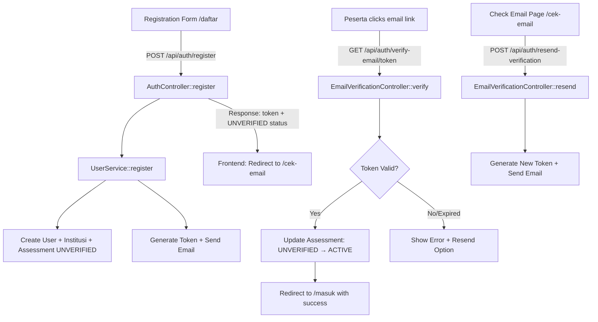
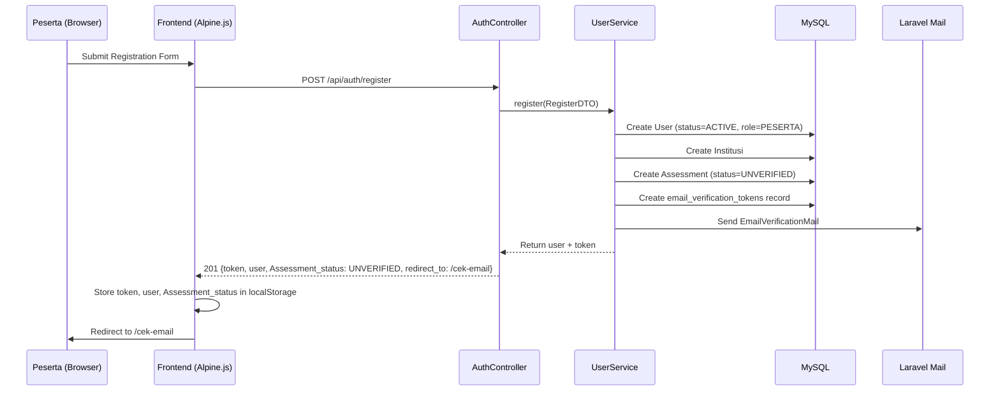
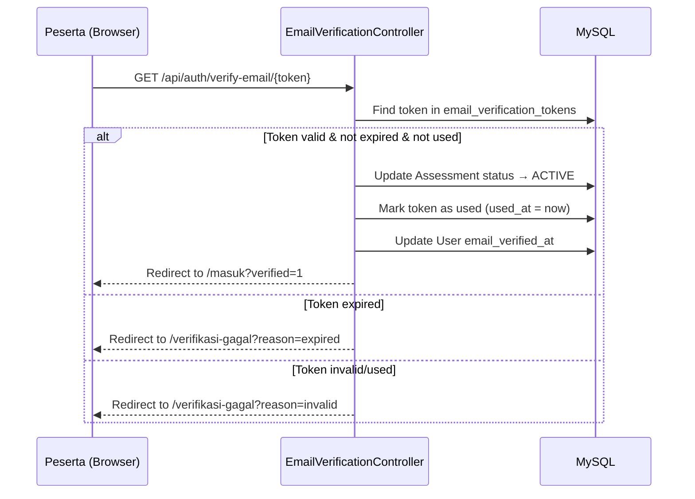
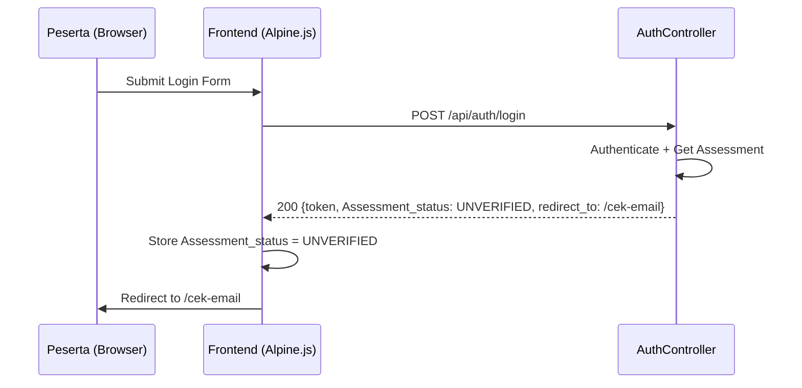

# Design Document: Email Verification Flow

## Overview

Fitur Email Verification Flow menambahkan langkah verifikasi email setelah registrasi peserta di Patriot Metric. Saat peserta menyelesaikan form pendaftaran, sistem membuat assessment dengan status `UNVERIFIED`, mengirim email konfirmasi berisi token link, dan mengarahkan peserta ke halaman "cek email". Peserta harus mengklik link verifikasi di email untuk mengubah status assessment menjadi `ACTIVE`, sehingga baru bisa mengakses halaman verifikasi data institusi (`/verifikasi`).

Fitur ini juga memastikan status `PUBLISHED` sudah tersedia di halaman reviewer detail (sudah ada di kode saat ini) dan menambahkan status `UNVERIFIED` ke dalam lifecycle assessment.

## Architecture



## Sequence Diagrams

### Registration Flow



### Email Verification Flow



### Login with UNVERIFIED Status



## Components and Interfaces

### Component 1: EmailVerificationController

**Purpose**: Handles email verification token validation and resend requests.

**Interface**:
```php
class EmailVerificationController extends Controller
{
    // GET /api/auth/verify-email/{token}
    // Public route - validates token and activates assessment
    public function verify(string $token): RedirectResponse;

    // POST /api/auth/resend-verification
    // Protected route (auth:sanctum) - resends verification email
    public function resend(Request $request): JsonResponse;
}
```

**Responsibilities**:
- Validate verification tokens against the database
- Update assessment status from UNVERIFIED to ACTIVE on successful verification
- Mark tokens as used to prevent reuse
- Handle expired/invalid token scenarios with appropriate redirects
- Generate new tokens and trigger email resend

### Component 2: EmailVerificationMail (Mailable)

**Purpose**: Laravel Mailable class that renders and sends the verification email.

**Interface**:
```php
class EmailVerificationMail extends Mailable implements ShouldQueue
{
    use Queueable, SerializesModels;

    public function __construct(
        public User $user,
        public string $verificationUrl,
        public string $institutionName
    );

    public function envelope(): Envelope;
    public function content(): Content;
}
```

**Responsibilities**:
- Render email template with verification link, institution name, and CTA button
- Queue email sending for non-blocking registration flow
- Use Laravel's built-in Mailable structure

### Component 3: EmailVerificationService

**Purpose**: Business logic for token generation, validation, and email dispatch.

**Interface**:
```php
class EmailVerificationService
{
    public function generateAndSendVerification(User $user, string $institutionName): void;
    public function verifyToken(string $token): array; // ['success' => bool, 'user_id' => ?int, 'reason' => ?string]
    public function resendVerification(User $user): void;
    public function invalidateExistingTokens(int $userId): void;
}
```

**Responsibilities**:
- Generate cryptographically secure tokens (64 chars, `Str::random(64)`)
- Store tokens with expiration in database
- Invalidate previous tokens when resending
- Validate token existence, expiration, and usage status
- Dispatch email via Laravel Mail

### Component 4: Frontend Guard Updates

**Purpose**: Update localStorage-based routing guards to handle UNVERIFIED status.

**Pages affected**:
- `daftar.blade.php` - After registration, redirect to `/cek-email` instead of `/masuk`
- `masuk.blade.php` - Handle UNVERIFIED status redirect to `/cek-email`
- `verifikasi.blade.php` - Block access when status is UNVERIFIED, redirect to `/cek-email`
- `cek-email.blade.php` (NEW) - Only accessible when status is UNVERIFIED

### Component 5: Check Email Page (cek-email.blade.php)

**Purpose**: Informational page shown after registration, with resend capability.

**Interface (Alpine.js x-data)**:
```javascript
{
    email: '',           // Displayed from localStorage auth_user
    isResending: false,  // Loading state for resend button
    cooldown: 0,        // Countdown timer preventing spam (60s)
    message: '',        // Success/error feedback

    async resendEmail() { /* POST /api/auth/resend-verification */ },
    startCooldown() { /* 60-second countdown timer */ }
}
```

## Data Models

### Model 1: email_verification_tokens (New Table)

```php
Schema::create('email_verification_tokens', function (Blueprint $table) {
    $table->id();
    $table->unsignedBigInteger('user_id');
    $table->foreign('user_id')->references('id')->on('users')->onDelete('cascade');
    $table->string('token', 64)->unique();
    $table->timestamp('expires_at');
    $table->timestamp('used_at')->nullable();
    $table->timestamps();

    $table->index(['token', 'expires_at']);
    $table->index('user_id');
});
```

**Validation Rules**:
- `token`: Unique, 64 characters, generated via `Str::random(64)`
- `expires_at`: Set to `now() + 60 minutes` on creation
- `used_at`: NULL until token is successfully used, then set to current timestamp
- One user can have multiple tokens (old ones invalidated on resend)

### Model 2: Assessment Status Enum Update

```php
// Migration: alter assessments table to add UNVERIFIED status
Schema::table('assessments', function (Blueprint $table) {
    $table->enum('status', ['UNVERIFIED', 'ACTIVE', 'IN_PROGRESS', 'SUBMITTED', 'GRADED', 'PUBLISHED', 'REJECTED'])
          ->default('ACTIVE')
          ->change();
});
```

**Status Lifecycle**:
```
UNVERIFIED → ACTIVE → IN_PROGRESS → SUBMITTED → GRADED → PUBLISHED
                                                        → REJECTED
```

### Model 3: EmailVerificationToken (Eloquent Model)

```php
class EmailVerificationToken extends Model
{
    protected $fillable = ['user_id', 'token', 'expires_at', 'used_at'];

    protected function casts(): array
    {
        return [
            'expires_at' => 'datetime',
            'used_at' => 'datetime',
        ];
    }

    public function user(): BelongsTo
    {
        return $this->belongsTo(User::class);
    }

    public function isExpired(): bool
    {
        return $this->expires_at->isPast();
    }

    public function isUsed(): bool
    {
        return $this->used_at !== null;
    }

    public function isValid(): bool
    {
        return !$this->isExpired() && !$this->isUsed();
    }
}
```

## Error Handling

### Error Scenario 1: Email Sending Failure

**Condition**: SMTP/mail driver fails during registration or resend
**Response**: Log error via `Log::error()`, return success response for registration (assessment still created), display "Kirim ulang" option on Check Email Page
**Recovery**: Peserta can click resend button; admin can check logs

### Error Scenario 2: Expired Token

**Condition**: Peserta clicks verification link after 60 minutes
**Response**: Redirect to `/verifikasi-gagal?reason=expired` page showing "Link sudah kedaluwarsa" message with resend button
**Recovery**: Peserta clicks resend, gets new email with fresh 60-minute token

### Error Scenario 3: Already Used Token

**Condition**: Peserta clicks same verification link twice
**Response**: Redirect to `/verifikasi-gagal?reason=invalid` showing "Link tidak valid atau sudah digunakan"
**Recovery**: If assessment is already ACTIVE, peserta can proceed to login normally

### Error Scenario 4: Invalid Token (Tampered/Non-existent)

**Condition**: Token string doesn't exist in database
**Response**: Redirect to `/verifikasi-gagal?reason=invalid` with generic error message
**Recovery**: Peserta must use resend from Check Email Page (requires login)

### Error Scenario 5: Race Condition on Token Usage

**Condition**: Two requests hit verify endpoint simultaneously with same token
**Response**: Use database transaction with `lockForUpdate()` to ensure only one succeeds
**Recovery**: Second request gets "already used" response

## Testing Strategy

### Unit Testing Approach

- **EmailVerificationService**: Test token generation (length, uniqueness), expiration calculation, validation logic (valid/expired/used), and token invalidation
- **EmailVerificationController**: Test verify() with valid/expired/invalid/used tokens, test resend() with authenticated user
- **UserService::register**: Test that assessment is created with UNVERIFIED status and verification email is dispatched
- **EmailVerificationToken Model**: Test `isExpired()`, `isUsed()`, `isValid()` methods

### Integration Testing Approach

- Full registration flow: POST /api/auth/register → verify email_verification_tokens record created → verify email queued
- Full verification flow: GET /api/auth/verify-email/{token} → verify assessment status changed to ACTIVE
- Login with UNVERIFIED: POST /api/auth/login → verify response contains UNVERIFIED status and /cek-email redirect
- Resend flow: POST /api/auth/resend-verification → verify old tokens invalidated, new token created, email queued

### Frontend Testing Approach

- Guard behavior: Verify `/verifikasi` redirects to `/cek-email` when Assessment_status is UNVERIFIED
- Guard behavior: Verify `/cek-email` redirects to `/verifikasi` when Assessment_status is ACTIVE
- Resend button: Verify cooldown timer prevents rapid resend clicks
- Login redirect: Verify login with UNVERIFIED status goes to `/cek-email`

## Security Considerations

- **Token entropy**: Use `Str::random(64)` for 384-bit entropy tokens, making brute-force infeasible
- **Token expiration**: 60-minute window limits exposure if email is compromised
- **Single-use tokens**: `used_at` field prevents replay attacks
- **Rate limiting**: Resend endpoint should have rate limiting (max 3 per 5 minutes per user) via Laravel's `throttle` middleware
- **Token invalidation on resend**: Previous tokens are invalidated when a new one is generated
- **No token in URL query params**: Token is part of the URL path (`/api/auth/verify-email/{token}`) to avoid logging in server access logs with query strings
- **Database locking**: `lockForUpdate()` in transaction prevents race conditions on token verification

## Performance Considerations

- **Queued emails**: `EmailVerificationMail` implements `ShouldQueue` to avoid blocking the registration response
- **Database indexes**: Composite index on `(token, expires_at)` for fast token lookup; index on `user_id` for invalidation queries
- **Token cleanup**: Consider a scheduled command to purge expired/used tokens older than 7 days (`email_verification_tokens:cleanup`)

## Dependencies

- **Laravel Mail**: Already configured in `.env` (SMTP settings)
- **Laravel Sanctum**: Already in use for token-based auth
- **Laravel Queue**: Required for async email sending (configure queue driver in `.env`)
- **Str::random()**: Laravel's `Illuminate\Support\Str` for secure token generation
- **No new packages required**: All functionality achievable with Laravel 11 built-in features
